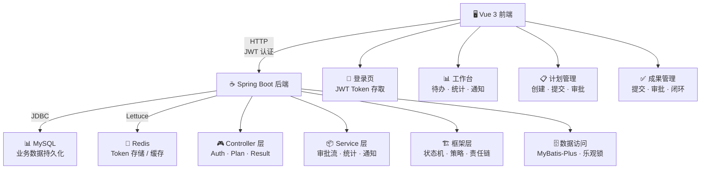
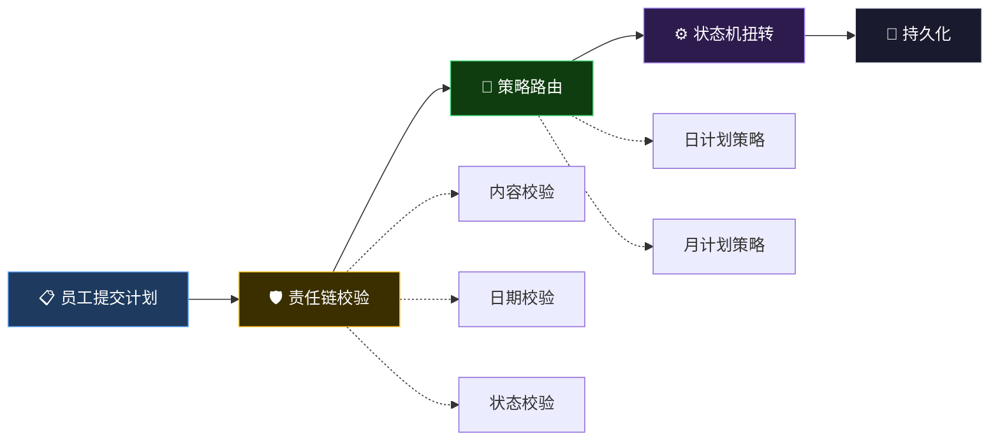
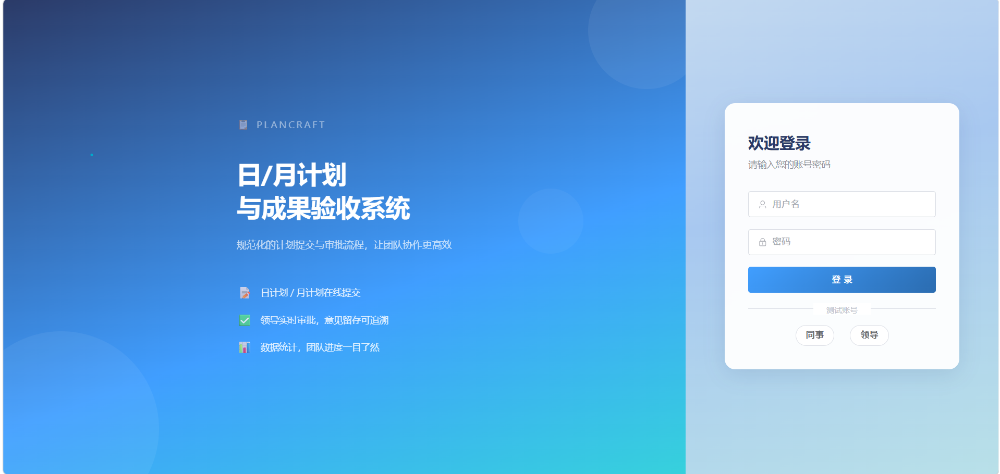
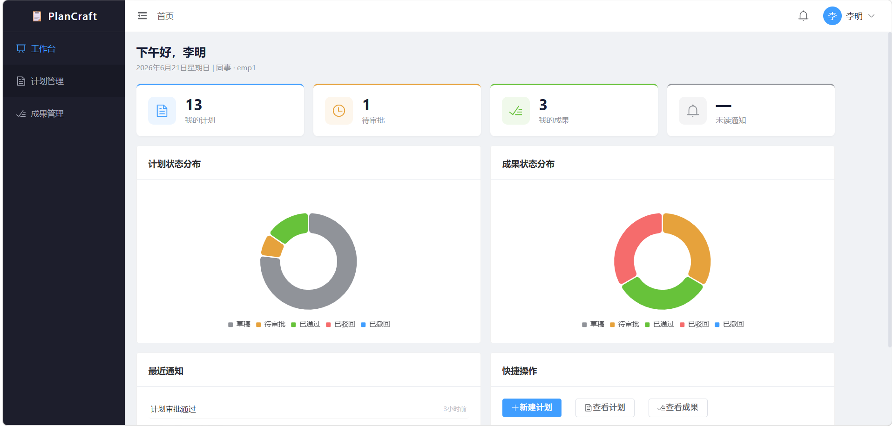
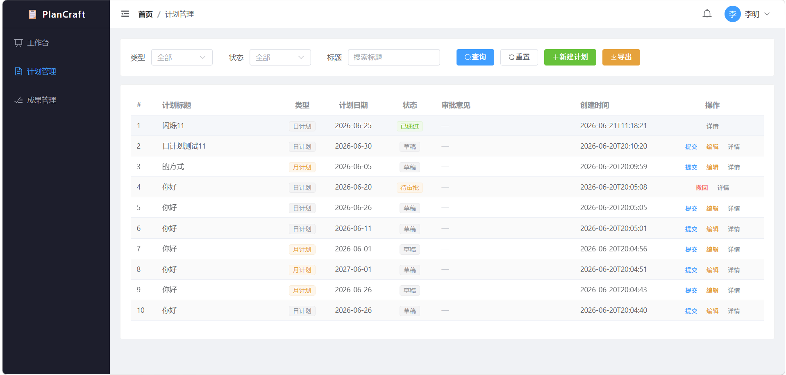
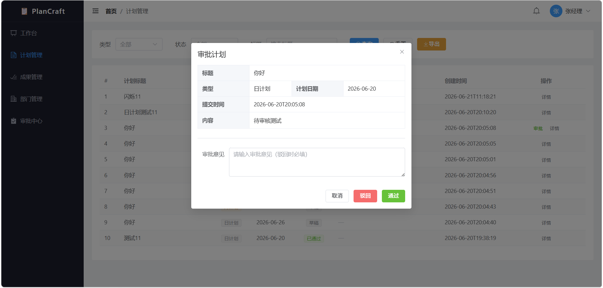
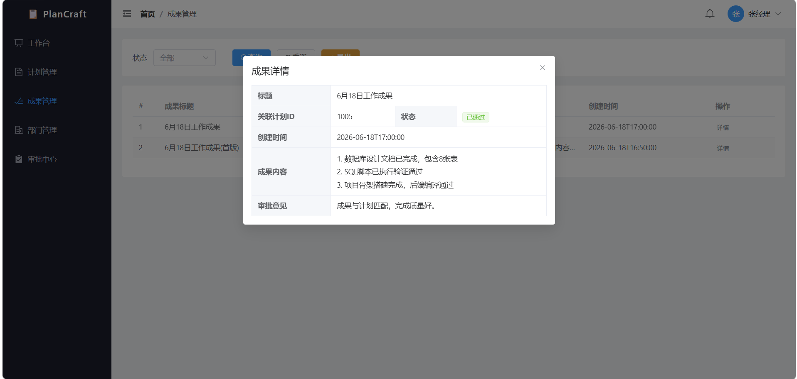
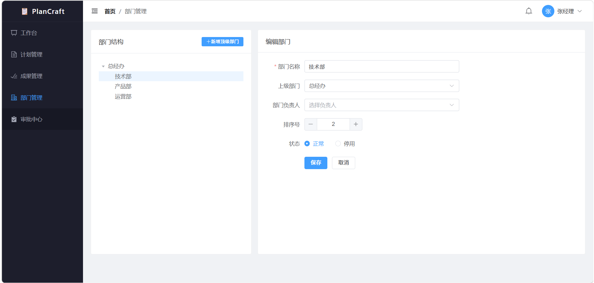

<div align="center">

# 📋 PlanCraft — 日/月计划与成果验收系统

**基于 Spring Boot 3 + Vue 3 构建的企业级审批流管理系统，内置状态机 + 策略模式 + 责任链三大设计模式架构，适合作为 Java 后端开发学习项目与简历展示项目。**

[](https://openjdk.org/)
[](https://spring.io/projects/spring-boot)
[](https://vuejs.org/)
[](https://element-plus.org/)
[](https://mysql.com/)
[](https://redis.io/)
[](https://baomidou.com/)
[](LICENSE)

</div>

---

## 📖 项目简介

PlanCraft 是一个"**Vue 3 前端 + Spring Boot 后端**"的**全栈日/月计划与成果验收系统**。员工可创建日计划/月计划并提交审批，领导在线审批（通过/驳回+意见），审批通过后员工提交成果，成果再走一轮审批，形成完整的"计划→成果→闭环"管理流程。

核心亮点是**三大设计模式协作架构**——有限状态机收敛状态流转保证数据安全，责任链解耦提交前的层层校验，策略模式隔离日/月计划的差异化逻辑。三者配合实现审批流引擎，后续加"季度计划""多级审批"只需改配置不动核心逻辑。配合乐观锁并发控制、数据级权限拦截器、JWT 无状态认证，构成企业级后端架构。

### 适用场景

- **企业内部管理**：员工日报/月报提交，领导在线审批，审批意见留存可追溯。
- **OKR 对齐**：月计划可附加 OKR 对齐说明，成果验收时对照检查。
- **架构学习与简历展示**：项目涵盖状态机、策略模式、责任链、乐观锁、数据权限、JWT 认证等核心后端知识点，适合作为 Java 后端开发学习项目。

**一句话总结**：不只是一个 CRUD 系统，更是一个企业级审批流架构学习项目。

---

## 🏗️ 系统架构



### 审批流核心架构



---

## ✨ 设计思考

### 审批流怎么做才不会变成"屎山"？

最朴素的实现是 Service 里一堆 `if(status == 1) { status = 2; }`，能跑，但随着需求增加（撤回、驳回、打回修改、作废），代码会瞬间失控。本项目的设计思路是**用三个成熟模式各管一件事，分层协作**：

```
用户请求 → 责任链(校验全通过?) → 策略路由(差异化逻辑) → 状态机(合法扭转) → 持久化
```

**状态机管"往哪动"** — 所有状态流转走 `StateMachine.fire(currentState, event)`，查表返回目标状态，非法跳转直接拦截。配合乐观锁 `WHERE version = #{version}` 防止并发覆盖。

**责任链管"能不能动"** — 提交前的校验（内容、日期、状态、配额）拆成独立 Handler，按 order 排序依次执行，任一失败则中断。新增校验只加 Handler，不改已有代码。

**策略模式管"怎么动"** — 日计划和月计划的校验逻辑完全不同（日期规则、附件要求），通过策略隔离。后续加"季度计划"只需新增一个策略类。

```
 ┌──────┐  submit  ┌────────┐  approve  ┌────────┐
 │ 草稿  │────────→│ 待审批  │─────────→│ 已通过  │
 │DRAFT │         │PENDING │          │APPROVED│
 └──┬───┘         └───┬────┘          └────────┘
    │  withdraw       │ reject
    └─────────────────┤
                      ↓
                 ┌────────┐
                 │ 已驳回  │ → 修改后重新提交
                 │REJECTED│
                 └────────┘
```

### 权限控制不只是"隐藏按钮"

单纯的 `ROLE_EMPLOYEE / ROLE_LEADER` 角色判断太基础了。真正的坑在**数据范围**：领导A只能审批自己部门下属的计划，不能看到别的部门的。

设计思路是引入 `user_relation` 汇报关系表，通过 MyBatis-Plus SQL 拦截器自动在查询语句中拼接 `WHERE user_id IN (下属ID集合)`，业务层写 `list()` 完全不关心权限，底层切面统一控制。这样做的好处是：后续如果要支持"一个员工向多个领导汇报"，只改关系表，不动业务代码。

---

## 🛠️ 技术栈

### 后端

| 技术 | 版本 | 用途 |
|------|------|------|
| Java | 17 | 开发语言 |
| Spring Boot | 3.2.5 | 后端主框架 |
| Spring Security | 6.2.x | JWT 认证 + 权限控制 |
| MyBatis-Plus | 3.5.6 | ORM 持久层 + 分页 + 乐观锁 |
| MySQL | 8.0 | 关系型数据库 |
| Redis | 7.0 | Token 存储、缓存 |
| JWT (jjwt) | 0.12.5 | 无状态认证 |
| Lombok | 1.18.x | 简化代码 |

### 前端

| 技术 | 版本 | 用途 |
|------|------|------|
| Vue | 3.4 | 前端主框架 |
| Vite | 5.x | 构建工具 |
| Element Plus | 2.7 | UI 组件库 |
| Vue Router | 4.3 | 路由管理 |
| Pinia | 2.1 | 状态管理 |
| Axios | 1.7 | HTTP 客户端 |
| ECharts | 5.5 | 数据可视化（Dashboard 饼图） |

---

## 📸 效果展示

| 登录页 | 工作台 |
| :----: | :----: |
|  |  |

| 计划管理 | 审批弹框 |
| :----: | :----: |
|  |  |

| 成果管理 | 部门管理 |
| :----: | :----: |
|  |  |

---

## 🚀 快速启动

### 环境要求

- JDK 17+
- Node.js 18+
- MySQL 8.0+
- Redis 7.0+

### 1. 数据库准备

```bash
# 在 Navicat 或命令行中执行
mysql -u root -p < backend/src/main/resources/db/schema.sql
```

> 执行后自动创建 `plancraft` 库、8 张表、初始部门和测试用户。

### 2. 后端启动

```bash
cd backend
# 编辑 src/main/resources/application-dev.yml 配置 MySQL / Redis 连接
mvn spring-boot:run
# 默认端口 8080
```

> 首次启动时 `DataInitializer` 会自动将数据库中的明文密码加密为 BCrypt，后续启动跳过。

### 3. 前端启动

```bash
cd frontend
npm install
npm run dev
# 默认端口 5173，自动代理 /api → localhost:8080
```

### 默认账号

| 角色 | 用户名 | 密码 | 说明 |
|------|--------|------|------|
| 管理员 | admin | admin123 | 系统管理员 |
| 领导 | leader1 | leader123 | 张经理，技术部负责人 |
| 员工 | emp1 | emp123 | 李员工，向 leader1 汇报 |
| 员工 | emp2 | emp123 | 王员工，向 leader1 汇报 |

---

## 📂 项目结构

```
PlanCraft/
├── backend/                            # Spring Boot 后端
│   ├── pom.xml
│   └── src/main/java/com/plancraft/
│       ├── config/                     # 配置层
│       │   ├── SecurityConfig              # Spring Security + JWT
│       │   ├── MybatisPlusConfig           # 分页 + 乐观锁 + 数据权限
│       │   ├── DataPermissionInterceptor   # ★ 数据权限拦截器
│       │   ├── RedisConfig                 # Redis 序列化
│       │   ├── CorsConfig                  # 跨域
│       │   └── DataInitializer             # 密码初始化
│       ├── common/                     # 通用层
│       │   ├── result/R                    # 统一响应 {code, message, data}
│       │   ├── result/ResultCode           # 响应码枚举
│       │   ├── exception/BusinessException # 业务异常
│       │   ├── exception/GlobalExceptionHandler # 全局异常处理
│       │   └── base/BaseEntity             # 公共字段 + 乐观锁
│       ├── auth/                       # 认证模块
│       │   ├── util/JwtUtil                # JWT 生成/解析/校验
│       │   ├── filter/JwtAuthFilter        # 认证过滤器
│       │   └── dto/LoginRequest            # 登录请求体
│       ├── framework/                  # ★ 核心设计模式框架
│       │   ├── statemachine/               # 有限状态机
│       │   ├── strategy/                   # 策略模式
│       │   └── chain/                      # 责任链
│       └── module/                     # 业务模块
│           ├── user/                       # 用户 + 汇报关系
│           ├── department/                 # ★ 部门管理
│           ├── plan/                       # 计划 + 审批
│           ├── result/                     # 成果 + 审批
│           └── notification/               # 通知
├── frontend/                           # Vue 3 前端
│   ├── src/
│   │   ├── api/                        # Axios 封装
│   │   ├── components/                 # 公共组件
│   │   ├── directives/                 # ★ 权限指令
│   │   ├── router/                     # 路由 + 登录守卫
│   │   ├── store/                      # Pinia 状态管理
│   │   ├── utils/                      # Token 工具
│   │   └── views/                      # 页面
│   └── vite.config.js
└── README.md
```

---

## 📝 简历写法参考

> 以下话术可直接用于简历项目经历描述，面试时围绕每条展开讲解即可。

**1. 设计并实现有限状态机引擎**，通过 `Map<State, List<Event>>` 注册转换规则，`fire()` 方法校验状态流转合法性，非法跳转直接拦截抛异常；配合 MyBatis-Plus `@Version` 乐观锁防止并发状态覆盖，解决"已驳回被覆盖成已通过"的数据一致性问题。

**2. 采用策略模式隔离日/月计划差异化逻辑**，定义 `Strategy<T, R>` 接口，通过 `StrategyRouter` 自动收集 Spring 容器中所有策略实现并按 type 路由；日计划校验日期=当天，月计划校验日期=当月且附加 OKR 对齐要求，后续扩展季度计划只需新增策略类，零侵入。

**3. 引入责任链模式解耦提交前校验**，将内容长度、日期合法性、状态校验、配额校验等逻辑拆分为独立 `Handler`，按 order 排序依次执行，任一失败则中断；新增校验规则只需新增 Handler，不修改已有代码，符合开闭原则。

**4. 实现数据级权限控制**，通过 `user_relation` 汇报关系表 + MyBatis-Plus SQL 拦截器，自动在查询 SQL 中拼接 `WHERE user_id IN (下属ID集合)`，业务层完全无感知，实现领导只看下属数据、员工只看自己的数据隔离。

**5. 基于 Spring Security + JWT 实现无状态认证**，自定义 `JwtAuthFilter` 从 Header 提取 Token 解析并设入 SecurityContext，配合 `@PreAuthorize` 注解实现方法级权限控制；前端 Axios 拦截器自动携带 Token，401 响应自动跳转登录页。

---

## 🎓 学完这个项目你能掌握什么

| 能力 | 对应代码 | 面试考点 |
|------|----------|----------|
| 状态机设计 | `framework/statemachine/` | 状态流转、并发安全、乐观锁 |
| 策略模式 | `framework/strategy/` | 开闭原则、Spring 自动注入、路由分发 |
| 责任链模式 | `framework/chain/` | 单一职责、链式调用、可插拔校验 |
| JWT 认证 | `auth/` + `config/SecurityConfig` | Token 生成/校验、无状态认证、过滤器链 |
| MyBatis-Plus | `config/MybatisPlusConfig` | 分页插件、乐观锁、动态 SQL |
| 数据权限 | `config/DataPermissionInterceptor` | SQL 拦截器、数据隔离 |
| RESTful API | `module/*/controller/` | 接口设计、状态码、权限控制 |
| Vue 3 全栈 | `frontend/` | 组合式 API、路由守卫、Axios 封装 |

---

## 📄 开源协议

[MIT License](LICENSE) — 可自由用于学习、毕设、简历项目。
